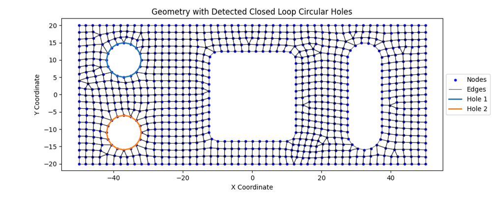

# Circular Hole Detector of Meshed Parts

## Overview
This Python script processes finite element (FE) mesh data from input files formatted for Abaqus or Nastran solver decks. It parses the input data to identify nodes, elements, and edges, and detects closed-loop circular holes within the mesh. The results, including nodes, edges, and detected holes, are visualized using Matplotlib.

---

## Features
- **Input Deck Parsing**:
  - Supports Abaqus (`*NODE`, `*ELEMENT`) and Nastran (`GRID`, `CTRIA3`, `CQUAD4`) formats.
- **Edge Generation**:
  - Constructs edges for elements and computes edge vectors for geometric analysis.
- **Circular Hole Detection**:
  - Detects closed-loop circular holes by analyzing the edges.
  - Utilizes NetworkX to identify connected components in the edge graph.
- **Visualization**:
  - Plots the mesh geometry with nodes, edges, and highlights detected holes.

---

## Requirements

### Libraries
The script relies on the following Python libraries:
- `numpy`: For numerical computations.
- `networkx`: For graph-based analysis of edges.
- `matplotlib`: For visualization.
- `os`: For file system interactions.
- `itertools`: For combinatorial operations.
- `collections`: For efficient data structures like `defaultdict`.

Install the required libraries using pip:
```bash
pip install numpy networkx matplotlib
```

---

## Usage

1. Prepare an input file in either Abaqus or Nastran format. Example filenames:
   - Abaqus: `mesh.inp`
   - Nastran: `mesh.bdf`

2. Update the `input_file` variable in the script or pass it as an argument to the main function.

3. Run the script:
```bash
python script_name.py
```

4. Example output:
```
Parsing input deck 'mesh.bdf' ...

    Parsed 100 nodes.
    Parsed 50 elements.
    Generated 200 edges.

    Found 2 closed loop hole(s) in meshed component.
Done.
```

---

## Functions

### Core Functions

1. **`parse_input_deck(input_file, solver_deck)`**:
   - Parses nodes, elements, and edges from the input file.
   - Generates edge vectors for further analysis.

2. **`detect_circular_holes(edges)`**:
   - Analyzes edges to detect closed-loop circular holes using graph theory.

3. **`visualize_geometry_and_holes(nodes, edges, closed_hole_groups)`**:
   - Visualizes the geometry, highlighting detected holes with distinct colors.

4. **`angle_between_vectors(vector1, vector2)`**:
   - Computes the angle between two vectors in degrees.

5. **`string2float(string)`**:
   - Converts scientific notation strings from Nastran input files to float.

### Main Function
The `main()` function orchestrates the workflow by:
- Parsing the input file.
- Detecting closed-loop holes.
- Visualizing the results.

---

## Example Input File

### Abaqus Format (`mesh.inp`):
```
*NODE
1, 0.0, 0.0, 0.0
2, 1.0, 0.0, 0.0
...
*ELEMENT
1, 1, 2, 3, 4
...
```

### Nastran Format (`mesh.bdf`):
```
GRID         852        44.0835917.94091     0.5
...
CTRIA3        11       0     265     262     266
...
```

---

## Outputs
- **Console Output**:
  - Number of nodes, elements, edges, and detected holes.
- **Visualization**:
  - A plot of the geometry with detected holes highlighted (only for testing with planar geometries).



---


## Contact
For any queries or suggestions, please feel free to write here :)

